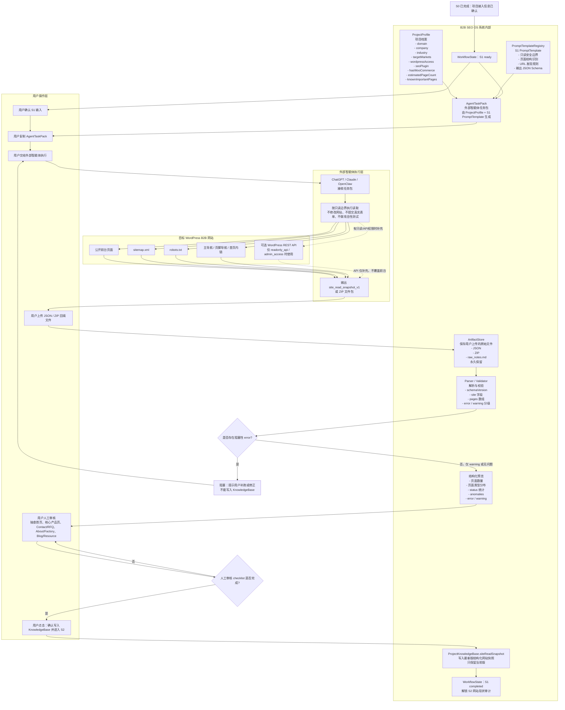
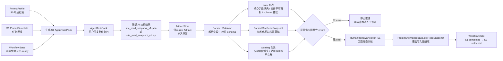
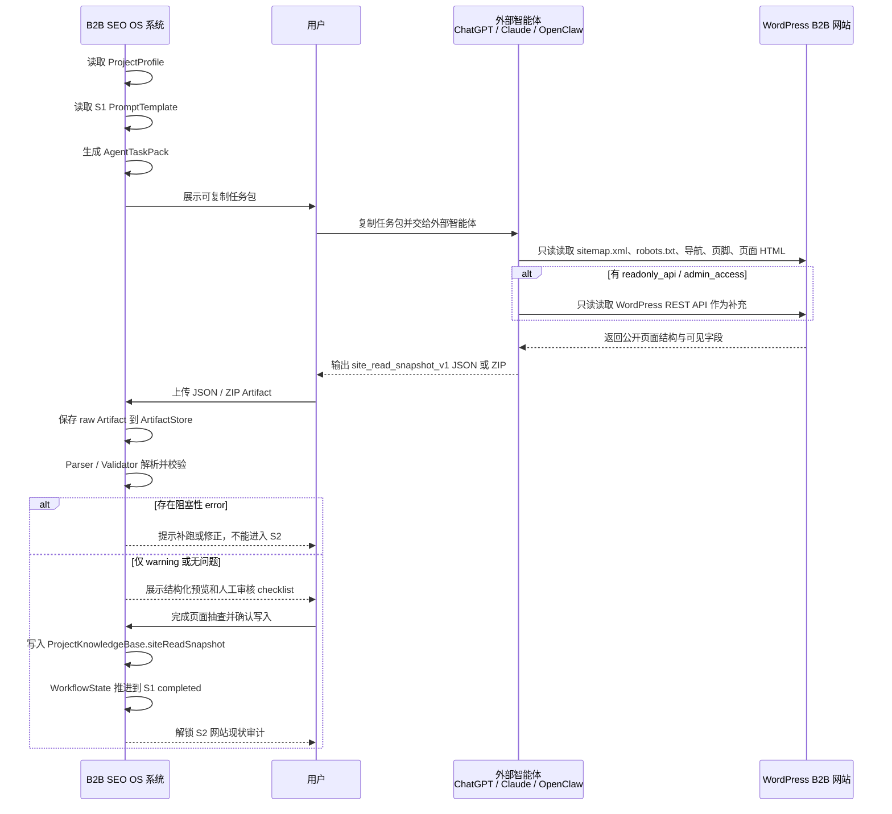
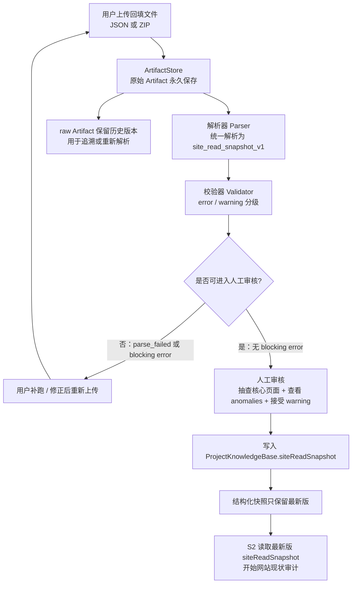
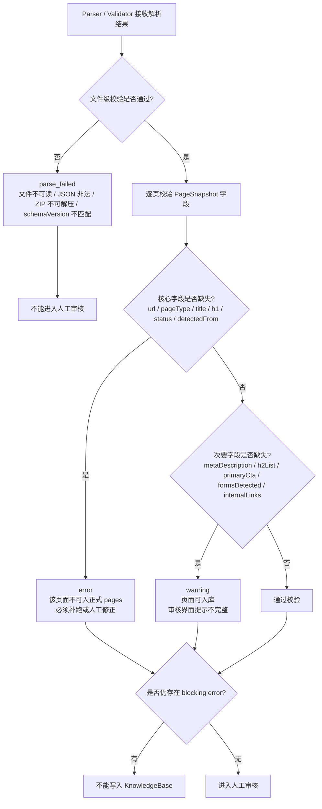
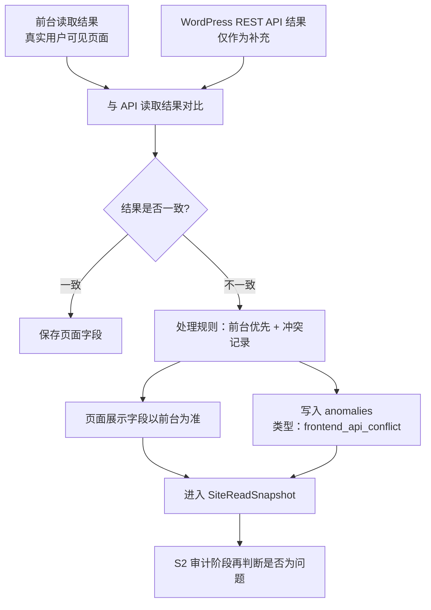
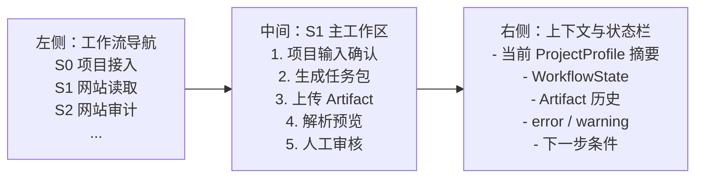

# B2B SEO OS — S1 可视化流程图

> Workflow Step: `S1_SITE_READ`  
> 配套文档：`S1_SITE_READ_SNAPSHOT_SPEC.md`  
> 重点：展示 S1 内部数据引用、外部 AI 交互逻辑、Artifact 回填、Parser/Validator 校验、KnowledgeBase 写入与 WorkflowState 推进。

---

## 1. 图示目标

S1 不是“系统自己爬站”，也不是“系统内置 AI 自动审计”。

S1 的产品逻辑是：

> B2B SEO OS 根据项目档案生成标准化任务包，用户把任务包交给外部智能体执行，外部智能体只读读取 WordPress 网站并返回结构化文件，系统再保存原始 Artifact、解析校验、人工审核，最后写入项目知识库并推进工作流。

因此，S1 必须同时展示 4 条线：

1. **系统内部数据线**：`ProjectProfile`、`PromptTemplateRegistry`、`WorkflowState`、`ArtifactStore`、`ProjectKnowledgeBase`。
2. **用户操作线**：复制任务包、交给外部 AI、上传回填文件、人工审核。
3. **外部 AI 执行线**：ChatGPT / Claude / OpenClaw 根据任务包读取网站并输出 `site_read_snapshot_v1`。
4. **目标网站读取线**：公开前台、sitemap、robots、导航、页脚、首页内链、可选 WordPress API。

---

## 2. S1 总流程图：系统数据引用 + 外部 AI 闭环

---

## 3. S1 数据流图：哪些内部对象被读取、生成、保存、推进

---

## 4. S1 外部 AI 交互图：系统不直接调用 AI，用户作为桥接层

---

## 5. S1 Artifact 与 KnowledgeBase 关系图

---

## 6. S1 error / warning 判断图

---

## 7. S1 前台与 API 冲突处理图

---

## 8. S1 图中关键对象说明

| 对象 | 所属层 | 作用 | 是否持久化 |
|---|---|---|---|
| `ProjectProfile` | 系统内部数据 | S0 项目档案，是 S1 任务包的上下文输入 | 是 |
| `PromptTemplateRegistry` | 系统内部数据 | 保存 S1 PromptTemplate，定义只读边界、读取步骤、输出格式 | 是 |
| `AgentTaskPack` | 系统生成物 | 用户复制给外部 AI 的标准化任务包 | 可保存执行记录 |
| 外部智能体 | 系统外部 | 执行读取任务，但不直接写入系统 | 否 |
| `site_read_snapshot_v1` | 回填结果 | 外部 AI 输出的结构化网站读取快照 | 原始文件进入 ArtifactStore |
| `ArtifactStore` | 系统内部数据 | 保存上传的 JSON / ZIP / raw notes，永久保留 | 是 |
| `Parser / Validator` | 系统内部逻辑 | 解析 Artifact，校验字段，生成 error / warning | 否，结果可保存 |
| `ProjectKnowledgeBase.siteReadSnapshot` | 系统内部数据 | S1 审核通过后的最新版结构化网站快照 | 是，仅保留最新版 |
| `WorkflowState` | 系统内部数据 | 控制 S1 状态推进和 S2 解锁 | 是 |
| `HumanReviewChecklist_S1` | 人工审核规则 | 要求用户抽查核心页面、确认 warning、查看 anomalies | 是，保存审核结果 |

---

## 9. S1 页面中的推荐视觉结构

---

## 10. 一句话总结

S1 的本质不是“爬虫功能”，而是：

> 把外部 AI 对 WordPress B2B 网站的只读读取能力，包装成一个可复制任务包、可回填 Artifact、可解析校验、可人工审核、可写入知识库、可推进状态机的标准化工作流。
